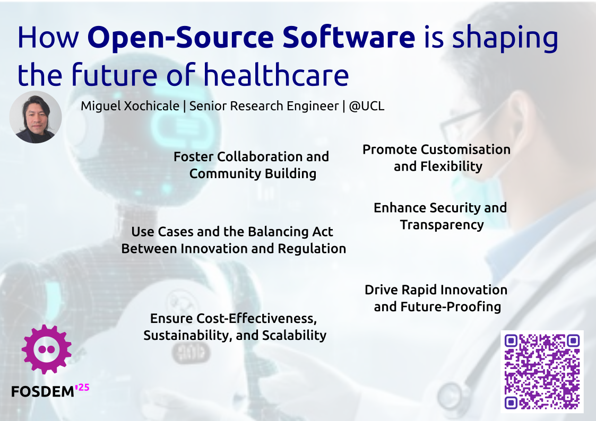

# Free and Open source Software Developers' European Meeting (FOSDEM) 

## CFP Open Research devroom
https://lists.fosdem.org/pipermail/fosdem/2024q4/003603.html 

### 1. Important dates:
- Proposal Deadline: 1 Dec 2024 23:59 CET
- Accepted talk announced: 2024-12-15
- FOSDEM Conference: Saturday 1st Feb 2025 morning + afternoon at Université libre de Bruxelles, Solbosch campus.
- Unofficial online session: to be announced soon

### 2. Submissions
- Title
How Open-Source Software is Shaping the Future of Healthcare

- Abstract

Open-source software has been a powerful catalyst for innovation in computer and software engineering, driving significant advancements in healthcare, particularly in medical and surgical technologies. 
Recently, the open-source movement has expanded beyond software, encompassing the release of code, data, and AI models, further accelerating progress across diverse fields. 
However, in healthcare, open-sourcing faces distinct challenges, including navigating regulatory hurdles to meet industry standards, ensuring robust patient data protection, managing the costs of specialised hardware and software maintenance, and addressing the limited availability of expert clinicians needed to annotate, test, and validate AI innovations.
In this talk, Miguel will explore how open-source technologies are advancing healthcare, with a focus on medical and surgical innovations. 
He will highlight key advancements while exploring the complexities of clinical translation, using three of his projects as examples: Fetal Ultrasound Image Synthesis, endoscopy-based video analysis for surgery, and real-time AI diagnosis of eye movement disorders.
The talk will examine the challenges of clinical translation and showcase examples of innovative technologies that leverage open-source software, models, and data to address some of the most complex problems in healthcare.
Finally, to inspire and spark innovation among the next generation of engineers, researchers, and clinicians from academia and industry, this talk will showcase how the emerging open-source software community for surgical and medical technologies is striving to:
(a) Foster Collaboration and Community Building
(b) Enhance Security and Transparency
(c) Promote Customisation and Flexibility
(d) Ensure Cost-Effectiveness, Sustainability, and Scalability
(e) Drive Rapid Innovation and Future-Proofing.

- Talk licence: FOSDEM is an open-source software conference, please specify which OSI approved license your proposal uses.   

Apache-2.0 license

- Speaker name, contact, biography and availability

Miguel Xochicale   
m.xochicale@ucl.ac.uk

Miguel is a Senior Research Engineer at University College London, UK, where he leads pioneering advancements in data-centric AI tools for Medical Imaging, MedTech, SurgTech, Biomechanics, and Clinical Translation. His work focuses on driving innovation and delivering impact in several critical areas: Real-time AI for surgery, eye movement disorders, and echocardiography, Sensor fusion data integrating wearable trackers with medical imaging, Generative models for fetal imaging, and Child-robot interaction in low-resource countries. By harnessing these cutting-edge technologies, he is dedicated to transforming healthcare through AI and making a lasting impact on patient care and medical research.

-tag-slug (optional)
"Short version of the title, used in the url if your talk is published. Use only lower case and hypen (-) to separate words. If not specified, the title will be slugified Please write at most 50 characters."   

`open-source-software-shaping-the-future-of-health`

- Session image (optional)
Use this if you want an illustration to go with your proposal. Please do not upload files larger than 160.0MB!

## References

https://opensource.com/article/23/1/open-source-software-transforming-healthcare  
https://github.com/ohcnetwork  
https://ixda.org/video/open-source-design-for-a-more-inclusive-healthcare-experience/   

https://www.clindcast.com/influence-of-open-source-software-in-shaping-the-future-of-healthcare-it
"""
1. Cost-Effectiveness
2. Interoperability and Integration
3. Customization for Healthcare Workflows
4. Community Collaboration and Innovation:
5. Security and Transparency:
6. Supporting Global Health Initiatives
7. Empowering Healthcare Innovation Startups
"""

https://opensource.com/article/23/1/open-source-software-transforming-healthcare

https://gnuhealth.org/index.html

https://www.the-qrcode-generator.com/

