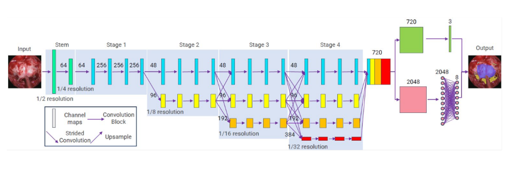

Miguel Xochicale

# 

<div style="background-color: rgba(22,22,22,0.75); border-radius: 10px; text-align:center; padding: 0px; padding-left: 1.5em; padding-right: 1.5em; max-width: min-content; min-width: max-content; margin-left: auto; margin-right: auto; padding-top: 0.2em; padding-bottom: 0.2em; line-height: 1.5em!important;">

<span style="color:#939393; font-size:1.5em; font-weight: bold;">How
Open-Source Software is</span>  
<span style="color:#939393; font-size:1.5em; font-weight: bold;">Shapping
the Future of Healthcare?</span>

<span style="padding-bottom: 0.5rem;"><br> </span>  
[](http://mxochicale.github.io/) Miguel Xochicale, Sr-RSE@ARC-UCL  
<span style="font-size:0.8em;"><span style="border-bottom: 0.5px solid #00ccff;">[
`mxochicale/`](https://github.com/mxochicale/)</span><span style="border-bottom: 0.5px solid #00ccff;">[`open-healthcare-slides`](https://github.com/mxochicale/open-healthcare-slides)</span></span>

</div>

<div class="footer">

<span class="dim-text" style="&quot;text-align:left;'">1-Feb-2025;
fosdem’25 [(grid-worms-animation 2023 by
saforem2)](https://github.com/saforem2/grid-worms-animation/)</span>

</div>

# Overview

- [From bench to bedside](#sec-b2b)
- Few use cases
  - [Fetal Ultrasound Image Synthesis](#sec-fus)
  - [Real-time AI diagnosis](#sec-rtai)
    <!--  * [Endoscopy-based video](#sec-ps) -->
    <!--  * [Eye movement disorders](#sec-ed) -->
- [Open-Source Software in Healthcare](#sec-ossh)
- [Takeaways](#sec-ta)

# :wrench: :hospital: From bench to bedside

## Innovation & regulation in Surg/Med/AI Tech <!-- ST - i'd argue that good regulation is a key driver of innovation. Without regulation you just have a bunch of people doing stuff they like, whereas with regulation you can drive innovation to achieve good societal impacts. So it's not one vs the other -->

<div style="margin-top: 0px; font-size: 50%;">


</div>

## :hospital: Challenges in the AI clinical translation

<div id="fig-template">


Figure 1: Medical AI translational challenges between system development
and routine clinical application

</div>

<div style="font-size: 40%;">

Li, Zhongwen, Lei Wang, Xuefang Wu, Jiewei Jiang, Wei Qiang, He Xie,
Hongjian Zhou, Shanjun Wu, Yi Shao, and Wei Chen. “Artificial
intelligence in ophthalmology: The path to the real-world clinic.” Cell
Reports Medicine 4, no. 7 (2023).

</div>

<div class="notes">

:wrench: :recycle: :hospital: Software as a Medical Device (SaMD)

</div>

## IEC 62304 standard for software

<div style="margin-top: 0px; font-size: 50%;">


</div>

<div style="font-size: 30%;">

https://www.iso.org/standard/38421.html

</div>

## Good ML practices by FDA

<div style="margin-top: 0px; font-size: 50%;">


</div>

<div style="font-size: 30%;">

US-FDA-Artificial-Intelligence-and-Machine-Learning-Discussion-Paper:
https://www.fda.gov/files/medical%20devices/published/US-FDA-Artificial-Intelligence-and-Machine-Learning-Discussion-Paper.pdf

</div>

<div class="notes">

Regulatory Framework for Modifications to (AI/ML)-Based Software as a
Medical Device (SaMD)

</div>

## ISO/IEC quality standards in the AI landscape

<div id="fig-template">


Figure 2: AI standarisation landscape

</div>

<div style="font-size: 30%;">

Janaćković, G., Vasović, D. and Vasović, B., 2024. ARTIFICIAL
INTELLIGENCE STANDARDISATION EFFORTS. ENGINEERING MANAGEMENT AND
COMPETITIVENESS (EMC 2024), p.250.  
Oviedo, Jesús, Moisés Rodriguez, Andrea Trenta, Dino Cannas, Domenico
Natale, and Mario Piattini. “ISO/IEC quality standards for AI
engineering.” Computer Science Review 54 (2024): 100681.

</div>

# Use case

Fetal Ultrasound Image Synthesis
<!-- this section (up to slide 25) seems very sciency and not very open - source softwarey. i.e. theres a lot of experiments and results, but it doesn't seem to be about open source software until you get to the last slide (xfetus). I think the audience at FOSDEM will be more interested in the software than the application. Can you simplify the science and significantly expand on the software? -->

## Dating Ultrasound Scan (12 week scan)

<div style="margin-top: 0px; font-size: 10%;">


</div>

<div style="font-size: 40%;">

Wright-Gilbertson M. 2014 in PhD thesis;
https://en.wikipedia.org/wiki/Gestational_age; National-Health-Service
2021. Screening for down’s syndrome, edwards’ syndrome and patau’s
syndrome. https://www.nhs.uk/pregnancy/your- pregnancy- care

</div>

## Challenges of US biometric measurements

- Operator dependant,
- Clinical system dependant,
- Fetal position,
- Similar morphological and echogenic characteristics in the US,
- **Few public datasets are available (we have only found three)**
  - Data masking: Anonymisation or pseudonymisation?
  - Personal Data Protection Policy

<div style="font-size: 40%;">

Sciortino et al. in Computers in Biology and Medicine 2017
https://doi.org/10.1016/j.compbiomed.2017.01.008; He et al. in Front.
Med. 2021 https://doi.org/10.3389/fmed.2021.729978

</div>

## AI/ML pipeline

<div id="sec-hp" style="margin-top: 0px; font-size: 10%;">


</div>

## Methods

<!-- this slide has a lot of copy paste text. Are you expecting the audience to read or understand it. What's the message you want to communicate here -->

Diffusion-Super-Resolution-GAN (DSR-GAN) Transformer-based-GAN

<div id="sec-hp" style="margin-top: 0px; font-size: 10%;">


</div>

<div style="font-size: 40%;">

M. Iskandar et al. “Towards Realistic Ultrasound Fetal Brain Imaging
Synthesis” in MIDL2023. https://github.com/xfetus/midl2023

</div>

## Image Quality Assessment

Quaility of synthesised images are evaluated with Frechet inception
distance (FID), measuring the distance between distributions of
synthetised and original images (Heusel et al., 2017).

The lower the FID number is, the more similar the synthetised images are
to the original ones. FID metric showed to work well with fetal head US
compared to other metrics (Bautista et al., 2012).

<div style="font-size: 40%;">

M. Iskandar et al. “Towards Realistic Ultrasound Fetal Brain Imaging
Synthesis” in MIDL2023. https://github.com/xfetus/midl2023

</div>

## Experiments: Design and results

<div id="sec-hp" style="margin-top: 0px; font-size: 10%;">


</div>

<div style="font-size: 40%;">

M. Iskandar et al. “Towards Realistic Ultrasound Fetal Brain Imaging
Synthesis” in MIDL2023. https://github.com/xfetus/midl2023

</div>

## Experiments: Design and results

<div id="sec-hp" style="margin-top: 0px; font-size: 10%;">


</div>

<div style="font-size: 40%;">

M. Iskandar et al. “Towards Realistic Ultrasound Fetal Brain Imaging
Synthesis” in MIDL2023. https://github.com/xfetus/midl2023

</div>

## Fetal US imaging with Diffusion models

<div id="sec-hp" style="margin-top: 0px; font-size: 50%;">


</div>

<div style="font-size: 40%;">

1)  Ho et al. 2020 ”Denoising Diffusion Probabilistic Models”
    https://arxiv.org/abs/2006.11239
2)  Fiorentino et al. 2022 ”A Review on Deep Learning Algorithms for
    Fetal Ultrasound-Image Analysis” https://arxiv.org/abs/2201.12260

</div>

##  github.com/xfetus/midl2023

<div id="sec-hp" style="margin-top: 0px; font-size: 10%;">


</div>

<div style="font-size: 40%;">

M. Iskandar et al. “Towards Realistic Ultrasound Fetal Brain Imaging
Synthesis” in MIDL2023. <https://github.com/xfetus/midl2023>

</div>

## xfetus :baby: :brain: :robot:

A Python-based library for synthesising ultrasound images of fetal
development

<div id="sec-hp" style="margin-top: 0px; font-size: 10%;">


</div>

<https://github.com/xfetus/xfetus>

<div class="notes">

TODO: \* Resolve PRs https://github.com/xfetus/xfetus/pulls \* Show
emojis in the main README

A library for ultrasound fetal imaging synthesis using:

- GANs,  
- transformers, and  
- diffusion models.

<div style="font-size: 50%;">

<https://github.com/xfetus/xfetus>

</div>

</div>

# Use case

:wrench: Developing real-time AI applications for diagnosis
<!-- can you expand on the open source ecosystem around Holoscan here? 
Do you have any videos or results you could show for real time diagnoses?
-->

## Real-time AI Applications for Surgery

<div id="fig-template">

<div style="margin-top: 0px; font-size: 80%;">


</div>

Figure 3: Development and deployment pipeline for real-time AI apps for
surgery

</div>

<div class="notes">

Pipeline with development and deployment of real-time AI apps for
surgery

{fig-align=center} {fig-pos=‘b’} b(bottom) h(here) p(page) t(top)

</div>

## NVIDIA Holoscan platform

<div class="columns">

<div class="column" width="50%">

Holoscan-SDK


[
`holoscan-sdk`](https://github.com/nvidia-holoscan/holoscan-sdk/tree/main)

[ `holohub`](https://github.com/nvidia-holoscan/holohub)

</div>

<div class="column" width="50%">

Clara-AGX


[
`Clara-AGX DevKit`](https://github.com/nvidia-holoscan/holoscan-docs/blob/main/devkits/clara-agx/clara_agx_user_guide.md)

[
`Orin-IGX DevKit`](https://github.com/nvidia-holoscan/holoscan-docs/blob/main/devkits/nvidia-igx-orin/nvidia_igx_orin_user_guide.md)

</div>

</div>

<div class="notes">

Holoscan platform

</div>

## Holoscan Core Concepts

<div id="fig-template">


Figure 4: Operator: An operator is the most basic unit of work in this
framework.

</div>

<div class="notes">

https://docs.nvidia.com/holoscan/sdk-user-guide/holoscan_operators_extensions.html

</div>

## Bring Your Own Model (BYOM)

<div class="panel-tabset">

### Workflow

<div id="fig-template">


Figure 5: Connecting Operators

</div>

### Python

``` python
import os
from argparse import ArgumentParser

from holoscan.core import Application

from holoscan.operators import (
    FormatConverterOp,
    HolovizOp,
    InferenceOp,
    SegmentationPostprocessorOp,
    VideoStreamReplayerOp,
)
from holoscan.resources import UnboundedAllocator


class BYOMApp(Application):
    def __init__(self, data):
        """Initialize the application

Parameters
----------
data : Location to the data
"""

        super().__init__()

        # set name
        self.name = "BYOM App"

        if data == "none":
            data = os.environ.get("HOLOSCAN_INPUT_PATH", "../data")

        self.sample_data_path = data

        self.model_path = os.path.join(os.path.dirname(__file__), "../model")
        self.model_path_map = {
            "byom_model": os.path.join(self.model_path, "identity_model.onnx"),
        }

        self.video_dir = os.path.join(self.sample_data_path, "racerx")
        if not os.path.exists(self.video_dir):
            raise ValueError(f"Could not find video data:{self.video_dir=}")

# Define the workflow
        self.add_flow(source, viz, {("output", "receivers")})
        self.add_flow(source, preprocessor, {("output", "source_video")})
        self.add_flow(preprocessor, inference, {("tensor", "receivers")})
        self.add_flow(inference, postprocessor, {("transmitter", "in_tensor")})
        self.add_flow(postprocessor, viz, {("out_tensor", "receivers")})


def main(config_file, data):
    app = BYOMApp(data=data)
    # if the --config command line argument was provided, it will override this config_file
    app.config(config_file)
    app.run()


if __name__ == "__main__":
    # Parse args
    parser = ArgumentParser(description="BYOM demo application.")
    parser.add_argument(
        "-d",
        "--data",
        default="none",
        help=("Set the data path"),
    )

    args = parser.parse_args()
    config_file = os.path.join(os.path.dirname(__file__), "byom.yaml")
    main(config_file=config_file, data=args.data)
```

### YAML

``` python
%YAML 1.2
replayer:  # VideoStreamReplayer
  basename: "racerx"
  frame_rate: 0 # as specified in timestamps
  repeat: true # default: false
  realtime: true # default: true
  count: 0 # default: 0 (no frame count restriction)

preprocessor:  # FormatConverter
  out_tensor_name: source_video
  out_dtype: "float32"
  resize_width: 512
  resize_height: 512

inference:  # Inference
  backend: "trt"
  pre_processor_map:
    "byom_model": ["source_video"]
  inference_map:
    "byom_model": ["output"]

postprocessor:  # SegmentationPostprocessor
  in_tensor_name: output
  # network_output_type: None
  data_format: nchw

viz:  # Holoviz
  width: 854
  height: 480
  color_lut: [
    [0.65, 0.81, 0.89, 0.1],
    ]
```

</div>

<div class="notes">

Speaker notes go here.

</div>

# Use case

Real-time AI diagnosis for endoscopic pituitary surgery

## :medical_symbol: Endoscopic Pituitary Surgery

<!-- how much of this video to you plan to show? Is you talk only 20 minutes? in which case this video would take a significant chunk out of it.
-->

<!-- the slides in this section have a lot of text, I'm not sure your audience will know what to look at -->

<https://www.youtube.com/embed/EwlRdxokdGk>

<div class="notes">

94,961 views 20 Nov 2012 Barrow Neurological Institute Neurosurgeon
Andrew S. Little, MD, demonstrates the process of removing a tumor of
the pituitary gland using minimally-invasive endoscopic neurosurgery.
https://www.youtube.com/watch?app=desktop&v=EwlRdxokdGk

553,519 views 28 May 2017 The pituitary gland is located at the bottom
of your brain and above the inside of your nose. Endoscopic pituitary
surgery (also called transsphenoidal endoscopic surgery) is a minimally
invasive surgery performed through the nose and sphenoid sinus to remove
pituitary tumors. https://www.youtube.com/watch?v=lwmgNLwt_ts

Mao, Zhehua, Adrito Das, Mobarakol Islam, Danyal Z. Khan, Simon C.
Williams, John G. Hanrahan, Anouk Borg et al. “PitSurgRT: real-time
localization of critical anatomical structures in endoscopic pituitary
surgery.” International Journal of Computer Assisted Radiology and
Surgery (2024): 1-8.

</div>

##  `real-time-ai-for-surgery`

### Getting started docs

<div id="fig-template">


Figure 6: Getting started documentation provide with a range of links to
setup, use, run and debug application including github workflow.

</div>

<div class="notes">

Speaker notes go here.

</div>

##  `real-time-ai-for-surgery`

### 🏥 Endoscopic pituitary surgery

<div class="panel-tabset">

### 👃 Multi-head Model



### 🌓 PhaseNet Model


</div>

<div class="notes">

Speaker notes go here.

</div>

##  `real-time-ai-for-surgery`

### 🏥 Endoscopic pituitary surgery

<div class="panel-tabset">

### 🔱 Multi AI models (python)

<div class="code-with-filename">

**multi-ai.py**

``` python

...

        # Define the workflow
        if is_v4l2:
            self.add_flow(source, viz, {("signal", "receivers")})
            self.add_flow(source, preprocessor_v4l2, {("signal", "source_video")})
            self.add_flow(source, preprocessor_phasenet_v4l2, {("signal", "source_video")})
            for op in [preprocessor_v4l2, preprocessor_phasenet_v4l2]:
                self.add_flow(op, multi_ai_inference_v4l2, {("", "receivers")})
            ### connect infereceOp to postprocessors
            self.add_flow(
                multi_ai_inference_v4l2, multiheadOp, {("transmitter", "in_tensor_postproOp")}
            )
            self.add_flow(multi_ai_inference_v4l2, segpostprocessor, {("transmitter", "")})
            self.add_flow(multi_ai_inference_v4l2, phasenetOp, {("", "in")})

        else:
            self.add_flow(source, viz, {("", "receivers")})
            self.add_flow(source, preprocessor_replayer, {("output", "source_video")})
            self.add_flow(source, preprocessor_phasenet_replayer, {("output", "source_video")})
            for op in [preprocessor_replayer, preprocessor_phasenet_replayer]:
                self.add_flow(op, multi_ai_inference_replayer, {("", "receivers")})
            ### connect infereceOp to postprocessors
            self.add_flow(
                multi_ai_inference_replayer, multiheadOp, {("transmitter", "in_tensor_postproOp")}
            )
            self.add_flow(multi_ai_inference_replayer, segpostprocessor, {("transmitter", "")})
            self.add_flow(multi_ai_inference_replayer, phasenetOp, {("", "in")})

        ## connect postprocessors outputs for visualisation with holoviz
        self.add_flow(multiheadOp, viz, {("out_tensor_postproOp", "receivers")})
        self.add_flow(segpostprocessor, viz, {("", "receivers")})
        self.add_flow(phasenetOp, viz, {("out", "receivers")})
        self.add_flow(phasenetOp, viz, {("output_specs", "input_specs")})

...
```

</div>

### 🔱 Multi AI models (YAML)

<div class="code-with-filename">

**multi-ai.yaml**

``` python

...

 multi_ai_inference_v4l2:
  #
  #
  # Multi-AI Inference Operator InferenceOp()
  #
  #
  backend: "trt"
  pre_processor_map:
    "pit_surg_model": ["prepro_v4l2"]
    "phasenet_model": ["prepro_PNv4l2"]
  inference_map:
    "pit_surg_model": ["segmentation_masks", "landmarks"]
    "phasenet_model": ["out"]
  enable_fp16: False
  parallel_inference: true # optional param, default to true
  infer_on_cpu: false # optional param, default to false
  input_on_cuda: true # optional param, default to true
  output_on_cuda: true # optional param, default to true
  transmit_on_cuda: true # optional param, default to true
  is_engine_path: false # optional param, default to false

multi_ai_inference_replayer:
  #
  #
  # Multi-AI Inference Operator InferenceOp()
  #
  #
  backend: "trt"
  pre_processor_map:
    "pit_surg_model": ["prepro_replayer"]
    "phasenet_model": ["prepro_PNreplayer"]
  inference_map:
    "pit_surg_model": ["segmentation_masks", "landmarks"]
    "phasenet_model": ["out"]
  enable_fp16: False
  parallel_inference: true # optional param, default to true
  infer_on_cpu: false # optional param, default to false
  input_on_cuda: true # optional param, default to true
  output_on_cuda: true # optional param, default to true
  transmit_on_cuda: true # optional param, default to true
  is_engine_path: false # optional param, default to false

...
```

</div>

</div>

<div class="notes">

Speaker notes go here.

 \`\`\`{.python
filename=“unit-test-example.py” code-line-numbers=“\|30-36”}

</div>

##  `real-time-ai-for-surgery`

### 🤝 Contributing

<div id="fig-template">


Figure 7: real-time-ai-for-surgery follows the Contributor Covenant Code
of Conduct. Contributions, issues and feature requests are welcome.

</div>

<div class="notes">

Speaker notes go here.

</div>

##  `real-time-ai-for-surgery`

### GitHub templates

<div class="panel-tabset">

### 🎒 new users


### 🔩 new models


### :recycle: PRs


</div>

<div class="notes">

Speaker notes go here. {.scrollable}

</div>

##  `real-time-ai-for-surgery`

### Release version summaries

<div class="panel-tabset">

### v0.1.0


### v0.2.0


### v0.3.0


### v0.4.0


### v0.5.0


</div>

<div class="notes">

Speaker notes go here. {.scrollable}

</div>

# Use case

0cular: Open-source Care Using SOTA AI for Real-time monitoring and
diagnosis

## :robot: :eyes: AI in ophthalmic imaging modalities

<div id="fig-template">


Figure 8: Practical application of AI in all common ophthalmic imaging
modalities

</div>

<div style="font-size: 40%;">

Li, Zhongwen, Lei Wang, Xuefang Wu, Jiewei Jiang, Wei Qiang, He Xie,
Hongjian Zhou, Shanjun Wu, Yi Shao, and Wei Chen. “Artificial
intelligence in ophthalmology: The path to the real-world clinic.” Cell
Reports Medicine 4, no. 7 (2023).

</div>

<div class="notes">

Nystagmus {.scrollable}

</div>

## :robot: :eyes: Eye movement disorders

<div class="columns">

<div class="column" width="50%">

- Nystagmus is an eye movement disorder characterized by involunatry eye
  oscillations.​
- Pathologic nystagmus is estimated to be 24 per 10,000 with a slight
  predilection toward European ancestry \[1\]​.

</div>

<div class="column" width="50%">


</div>

</div>

<div style="font-size: 40%;">

\[1\] Sarvananthan, Nagini, Mylvaganam Surendran, Eryl O. Roberts,
Sunila Jain, Shery Thomas, Nitant Shah, Frank A. Proudlock et al. “The
prevalence of nystagmus: the Leicestershire nystagmus survey.”
Investigative ophthalmology & visual science 50, no. 11 (2009):
5201-5206.​

</div>

<div class="notes">

Nystagmus {.scrollable}

</div>

## :robot: :eyes: Real-time AI Diagnosis for Nystagmus

<!-- ST: I like the animations here -->

<div id="fig-template">


Figure 9: End-to-end workflow

</div>

<div class="notes">

Demo {.scrollable}

</div>

## 🤖 👁️ READY

A Python-based library for REal-time Ai Diagnosis for nYstagmus

<div id="sec-hp" style="margin-top: 0px; font-size: 10%;">


</div>

<https://github.com/0cular/ready>

<div class="notes">

…

</div>

## :robot: :eyes: Real-time AI Diagnosis for Nystagmus

<!-- I like the animations here -->


<div class="notes">

Demo {.scrollable}

</div>

## :robot: :eyes: Real-time AI Diagnosis for Nystagmus

Future work

<div class="columns">

<div class="column" width="50%">

Real-time AI guidance for high-quality images (Liu et al. 2023)


</div>

<div class="column" width="50%">

Implement UNET-Visual Transformer models (Yao et al. 2022)  


[github.com/0cular/unetvit4sclera](https://github.com/0cular/unetvit4sclera)

</div>

</div>

<div style="font-size: 40%;">

Liu, L., Wu, X., Lin, D., Zhao, L., Li, M., Yun, D., Lin, Z., Pang, J.,
Li, L., Wu, Y. and Lai, W., 2023. DeepFundus: a flow-cytometry-like
image quality classifier for boosting the whole life cycle of medical
artificial intelligence. Cell Reports Medicine, 4(2).

Yao, Chang, Menghan Hu, Qingli Li, Guangtao Zhai, and Xiao-Ping Zhang.
“Transclaw u-net: claw u-net with transformers for medical image
segmentation.” In 2022 5th International Conference on Information
Communication and Signal Processing (ICICSP), pp. 280-284. IEEE, 2022.

</div>

<div class="notes">

Plans {.scrollable}

</div>

# Open-Source Software in Healthcare

## 

<div class="footer">

[
https://github.com/oss-for-surgtech/workshop-hamlyn2024](https://github.com/oss-for-surgtech/workshop-hamlyn2024)

</div>

## Healing Through Collaboration

<!-- Open-Source Software in Surgical, Biomedical and AI Technologies -->

<div id="sec-mt" style="margin-top: 0px; font-size: 50%;">


</div>

<div class="notes">

https://github.com/openregulatory/templates

</div>

# Key Takeaways

. . .

- :wrench: :hospital: Challenges in translating research from bench to
  bedside.
- :robot: :recycle: Use cases for synthetic data and real-time AI-driven
  diagnosis.

. . .

How to shape the future of Healthcare using Open-Source Software!!!\*

. . .

- :school_satchel: Contribute to the creation of high-quality
  educational and training materials.
-  Release open-source code, data, and models in alignment with quality
  standards.

## 🙌 Acknowledgements

- Diego Kaski
  - UCL Queen Square Institute of Neurology
- Zhehua Mao, Sophia Bano and Matt Clarkson
  - Wellcome / EPSRC Centre for Interventional and Surgical Sciences
    (WEISS) at UCL
- Mikael Brudfors and Nadim Daher
  - NVIDIA Healthcare AI
- Steve Thompson et al.
  - Advanced Research Computing Centre (ARC) at UCL

# Additional slides

## The First Regulatory Clearance of an Open-Source Automated Insulin Delivery Algorithm

- In 2018, Tidepool launched the Tidepool Loop initiative to generate
  real-world evidence and seek regulatory clearance for Loop.
- By late 2020, Tidepool submitted an application to the FDA for an
  interoperable automated glycemic controller (iAGC) based on Loop.
- After 2 years, the FDA approved the Tidepool Loop iAGC on January 23,
  2023.

<div style="font-size: 40%;">

Braune, Katarina, Sufyan Hussain, and Rayhan Lal. “The first regulatory
clearance of an open-source automated insulin delivery algorithm.”
Journal of Diabetes Science and Technology 17, no. 5 (2023): 1139-1141.
[DOI](https://journals.sagepub.com/doi/10.1177/19322968231164166)
[Citations](https://scholar.google.com/scholar?cites=11792880181049903500&as_sdt=2005&sciodt=0,5&hl=en)

<https://www.tidepool.org/open>

<https://github.com/tidepool-org>

<https://github.com/LoopKit>

</div>

<div class="notes">

- Food and Drug Administration (FDA
- The \#WeAreNotWaiting diabetes movement continues demanding safety and
  innovation at a faster pace than industry and regulators can currently
  offer. {.scrollable}
- Other examples Reimagining Public Healthcare with AI
  https://ohc.network/

</div>

## FDA-approved AI-based Medical Devices

<!-- ST I find the 7 slides in this section very difficult to follow. It should be better when you're talking to them, but just reading them I'm not sure what you're trying to communicate -->

<div style="margin-top: 0px; font-size: 50%;">


</div>

<div style="font-size: 40%;">

Benjamens, S., Dhunnoo, P. and Meskó, B. The state of artificial
intelligence-based FDA-approved medical devices and algorithms: an
online database. npj Digit. Med. 3, 118 (2020).

</div>

## TransThalamic

Fetal Brain Ultrasound Image Dataset

<div id="sec-hp" style="margin-top: 0px; font-size: 10%;">


</div>

<div style="font-size: 40%;">

Burgos-Artizzu, X et al. (2020). FETAL PLANES DB: Common maternal-fetal
ultrasound images \[Data set\]. In Nature Scientific Reports (1.0, Vol.
10, p. 10200). Zenodo. https://doi.org/10.5281/zenodo.3904280

</div>

## TransCerebellum Plain

Fetal Brain Ultrasound Image Dataset

<div id="sec-hp" style="margin-top: 0px; font-size: 10%;">


</div>

<div style="font-size: 40%;">

Burgos-Artizzu, X et al. (2020). FETAL PLANES DB: Common maternal-fetal
ultrasound images \[Data set\]. In Nature Scientific Reports (1.0, Vol.
10, p. 10200). Zenodo. https://doi.org/10.5281/zenodo.3904280

</div>

## TransVentricular Plane

Fetal Brain Ultrasound Image Dataset

<div id="sec-hp" style="margin-top: 0px; font-size: 10%;">


</div>

<div style="font-size: 40%;">

Burgos-Artizzu, X et al. (2020). FETAL PLANES DB: Common maternal-fetal
ultrasound images \[Data set\]. In Nature Scientific Reports (1.0, Vol.
10, p. 10200). Zenodo. https://doi.org/10.5281/zenodo.3904280

</div>

## Research Questions

- Research and implement deep learning methods for generating synthetic
  fetal ultrasound images for both normal and abnormal cases,
- Propose and apply methods to evaluate quantitative and qualitative
  images of fetal us image synthesis.

## GAN-based fetal imaging

<div id="sec-hp" style="margin-top: 0px; font-size: 10%;">


</div>

<div style="font-size: 40%;">

1)  Bautista et al. 2022, ”Empirical Study of Quality Image Assessment
    for Synthesis of Fetal Head Ultrasound Imaging with DCGANs” MIUA
    https://github.com/xfetus/miua2022 (b) Liu et al. 2021 ”Towards
    Faster and Stabilized GAN Training for High-fidelity Few-shot Image
    Synthesis” https://arxiv.org/abs/2101.04775

</div>

## My trajectory

<div id="sec-mt" style="margin-top: 0px; font-size: 50%;">


</div>
